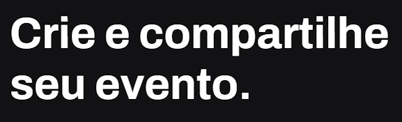

<h1 align="center">
    <a href="https://mrpmontes.github.io/EventForms/">
        
    </a>
</h1>

<p align="center">
  <a href="#-tecnologias">Tecnologias</a>&nbsp;&nbsp;&nbsp;|&nbsp;&nbsp;&nbsp;
  <a href="#-projeto">Projeto</a>&nbsp;&nbsp;&nbsp;|&nbsp;&nbsp;&nbsp;
  <a href="#-layout">Layout</a>
</p>

<p align="center">
   <a href="https://github.com/MrPMontes/treine.me/pulls">
     
   </a>
</p>

<br>

<p align="center">
  
</p>

## 🚀 Tecnologias

Esse projeto foi desenvolvido com as seguintes tecnologias:

- [HTML](https://developer.mozilla.org/pt-BR/docs/Web/HTML)
- [CSS](https://developer.mozilla.org/pt-BR/docs/Web/CSS)

## 💻 Projeto

O projeto foi desenvolvido para colocar em prática os conhecimentos adquiridos na parte de formulários utilizando HTML e CSS.
<br>
EventForms é uma Landing Page fictícia para cadastro e compartilhamento de eventos.

## 🔖 Layout

Você pode visualizar o layout do projeto através [desse link](https://www.figma.com/file/KPN13qwzpo9bM3v98VIMdh/Projeto-03-EventForms). Lembrando que você precisa ter uma conta no [Figma](http://figma.com/) para acessá-lo.

---

## ⌨ Como executar o projeto

```bash
# Clonar o repositório
git clone https://github.com/MrPMontes/treine.me

# Entrar no diretório
cd treine.me
```

Feito isso, execute no seu navegador o arquivo `index.html`

ou

Para ver o projeto online clique no <a href="https://mrpmontes.github.io/EventForms/">link</a>.

---


Feito com ♥ by Pedro Augusto Montes :wave:
